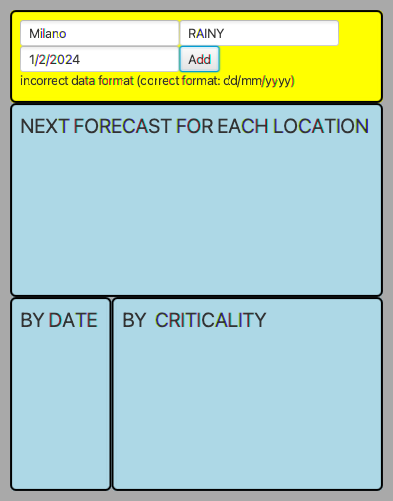

# CORSO INGEGNERIA DEL SOFTWARE A.A. 2023/24

## APPELLO 24 gennaio 2024

* <Cognome> <Nome> <matricola>

Occorre effettuare il **fork** di questo repository e modificare questo README
inserendo l'anagrafica seguendo lo schema sopra riportato. Inoltre vanno
concessi i **permessi di lettura** ai docenti (`carlo.bellettini` e
`mattia.monga`).

## Centro Meteo

Obiettivo dell'esercizio è progettare e realizzare un insieme di classi atte a
produrre un semplice programma Java che si occupi di gestire segnalazioni meteo
riguardo a località a piacere (massimo 4). Le segnalazioni possibili, in ordine
crescente di criticità sono:

- RAINY,
- THUNDERSTORM,
- HURRICANE,
- TYPHOON,
- CYCLONE

Ogni segnalazione è associata a una località e alla data cui la segnalazione
(previsione) si riferisce. Le segnalazioni si riferiscono sempre a date nel
futuro e possono essere cambiate in qualsiasi momento: una segnalazione relativa
alla stessa località e nella stessa data sovrascrive una precedente; è possibile
avere previsioni diverse per la stessa località e date differenti.

Vengono già fornite due *Viste* del sistema:

- [`InputForecastView`](src/main/java/it/unimi/di/sweng/esame/view/InputForecastView.java):
  permette di immettere la segnalazione relativa a una criticità prevista in una
  località a una data (dd/mm/yy).
- [`DisplayView`](src/main/java/it/unimi/di/sweng/esame/view/DisplayView.java):
  permette di visualizzare un elenco di segnalazioni.

Viene fornita anche una prima versione della classe  [`Main`](src/main/java/it/unimi/di/sweng/esame/Main.java) che
permette d'istanziare la parte statica delle viste, e di una
interfaccia [`InputPresenter`](src/main/java/it/unimi/di/sweng/esame/presenter/InputPresenter.java).

**TUTTE LE CLASSI DATE POSSONO ESSERE DA VOI MODIFICATE (CANCELLATE, COMPLETATE) PER ADERIRE A VOSTRE IDEE DI
PROGETTAZIONE**

Lanciando il programma (tramite il task `run` di gradle) si ottiene una interfaccia simile a quella nella figura
sottostante.

## TRACCIA

Completare, in modo da realizzare un'organizzazione del sistema di tipo
*Model-View-Presenter*, aggiungendo le classi necessarie in modo che
all'immissione di una nuova spesa le viste si aggiornino coerentemente:

- La vista con titolo NEXT FORECAST FOR EACH LOCATION riporta per ogni località
  (max 4) la segnalazione relativa alla data più prossima all'attuale
- La vista con titolo BY DATE riporta le prime quattro segnalazioni in ordine di
  data, dalla più prossima all'attuale alla più lontana nel futuro
- La vista con titolo BY CRITICALITY riporta le prime quattro segnalazioni in
  ordine decrescente di criticità

### Esempi di esecuzione

Il codice fornite prevede anche alcuni test di integrazione:

`testDisplayStart` controlla che all'inizio la situazione sia:

`testCorrectSingleInput` controlla che dopo una singola immissione
  - Milano HURRICANE 06/08/2024 

la situazione sia:

`testCorrectMultiInputWithSameLocation` controlla che dopo alcune immissioni (notare che la seconda avendo stessa località e data, sovrascrive la prima):
  - Milano HURRICANE 06/08/2024
  - Milano TYPHOON 06/08/2024
  - Milano RAINY 07/08/2024

 la situazione sia:

### Gestione input errati

Nel caso in cui l'utente inserisca un input non valido il sistema
deve mostrare un messaggio di errore (tramite il metodo `showError`) nella vista appropriata. Di seguito alcuni esempi testati con test di integrazione.

### Processo

Una volta effettuato il **clone** del repository, il candidatə completa l'implementazione seguendo la *metodologia TDD*;
in maggior dettaglio, ripetendo i passi seguenti fino ad aver implementato tutte le funzionalità richieste:

* scelta la prossima funzionalità richiesta da implementare, inizia una feature di gitflow
* implementa un test per la funzionalità,
* verifica che **il codice compili correttamente**, ma l'**esecuzione del test fallisca**; solo a questo punto effettua
  un *commit*
  (usando `IntelliJ` o `git add` e `git commit`) iniziando il messaggio di commit con la stringa `ROSSO:`,
* aggiunge la minima implementazione necessaria a realizzare la funzionalità, in modo che **il test esegua con
  successo**; solo a questo punto
  effettua un *commit* (usando `IntelliJ` o `git add` e `git commit`) iniziando il messaggio di commit con la
  stringa `VERDE:`,
* procede, se necessario, al **refactoring** del codice, accertandosi che le modifiche non
  comportino il fallimento di alcun test; solo in questo caso fa seguire a ogni
  passo un *commit* (usando `IntelliJ` o `git add` e `git commit`)
  iniziando il messaggio di commit con la stringa `REFACTORING:`,
* ripete i passi precedenti fino a quando non considera la funzionalità realizzata nel suo complesso e allora chiude la
  feature di gitflow
* effettua un *push* dei passi svolti su `gitlab.di.unimi.it` con `IntelliJ` o`git push --all`.

### Testing

Mano a mano che si sviluppa il progetto, si deve controllare di mantenere una copertura, sia dei comandi che delle
decisioni, soddisfacente (se inferiore al 100% inserire un commento che spieghi perché non è possibile raggiungerlo).

Sono presenti anche alcuni test di integrazione che il progetto
 "dovrebbe" passare (le situazioni testate sono presentate nelle figure precedent). 

 Ricordiamo che al fine del calcolo della copertura contano solo i test di unità e non quelli di integrazione.

### Consegna

Al termine del laboratorio occorre impacchettare l'ultima versione stabile come
una _release_ di gitflow chiamata "consegna" (usare esattamente questo nome) ed
effettuare un ultimo *push* di tutti i rami locali (comprese eventuali feature
aperte ma non completate).

## **Verificate su `gitlab.di.unimi.it`** che ci sia la completa traccia dei *commit* effettuati nei vari *branch* e che ci siano anche i *tag*. 

# Infine chiaramente anche di averne dato visibilità ai docenti. 
